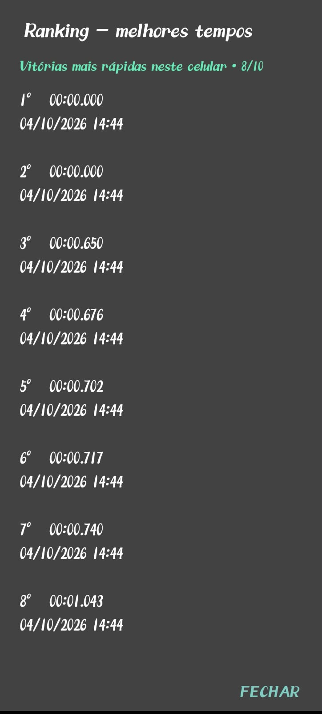

## Aluno:  Gustavo Santos Oliveira
## Disciplina: Computação Móvel
# Projeto - Campo minado

### O projeto foi desenvolvido integralmente com com aplicações na linguagem java. A estrutura se divide em três classes, sendo a principal, MainActivity.java, utilizada para configurar e estilar a interface, configurar butões e gestos. Em conjunto, a classe Game.java é responsável por atribuir a lógica de gameplay do jogo. O tabuleiro contém 15 bombas distribuídas de forma aleatória a cada rodada, o sistema indicará, a cada jogada, quantas casas seguras restam na rodada atual. Por fim, a classe Ranking.java foi desenvolvida para guardar as dez melhores jogadas que resultantes de vitórias, sendo armazenado o tempo de jogo, tabela de colocação, data e hora da finalização do jogo.

## Visualização do ranking

## Visualização do tempo
